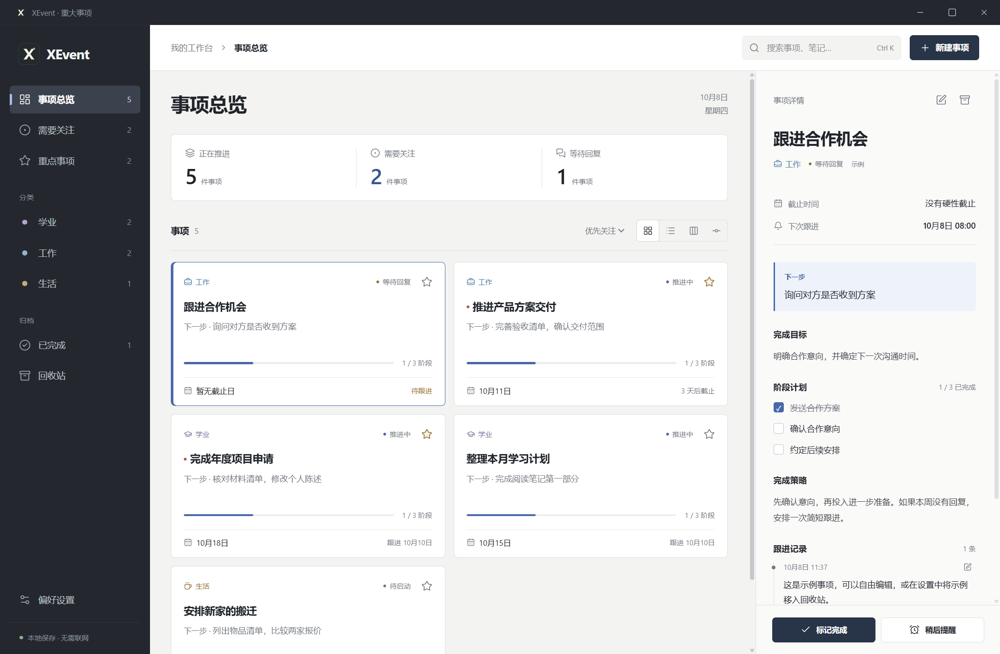

[English](README.md) · 简体中文

# Deadline Tracker - XEvent

在 Windows 本地管理重要事项、截止时间、计划和跟进记录的桌面工作台。

XEvent 是一个个人项目，用于集中记录学业、工作和生活中的重要安排。当前软件界面为简体中文。应用版本：**1.0.2**；JSON 数据格式版本：**1**。



截图来自真实 Electron 程序，使用内置的虚构示例。示例日期随加载日期变化，编号和时间戳也会变化。

## 功能与适用范围

- 独立的截止与跟进时间；优先级、重点标记、目标、策略和下一步行动。
- 带进度的阶段清单；可编辑的 Markdown 跟进记录和 HTTP/HTTPS 资料链接。
- 卡片、列表、可拖动状态的看板、截止时间线；分类、搜索与排序。
- 完成与重新开始、可恢复的回收站、浅色／深色／系统主题、快捷键。
- 本地 JSON 存储、自动备份、手动导出与导入；按编号和更新时间合并。
- Windows 跟进、临近截止、逾期及每日汇总通知；稍后提醒、托盘驻留，以及打包 EXE 中可选的开机启动。

软件面向单人本地使用，没有云同步、协作服务、账号或服务端数据库。安装或构建完成后，管理本地事项无需联网；打开外部资料链接时可能需要网络。

## 环境要求

- **本地已验证：** Windows 11 Home x64，系统构建 26200；Node.js **22.23.2**、npm **10.9.8**、Electron **44.5.1**。Electron 内嵌 Node 与开发环境 Node 不是同一个版本。
- 开发请使用带 npm 的 Node.js **22.23.2**；依赖要求 Node >=22.12.0。其他 Node 版本及 Windows 10 本次未验证；Linux/macOS 桌面运行和打包未验证。
- 全新安装／构建需要 Git，并能访问 npm、Electron 下载地址及打包工具。无需项目 API 密钥、付费服务、模型、外部数据集或签名证书。
- 本文可移植版构建流程使用 Windows x64；EXE 使用者不需要安装 Node.js。依赖与构建产物占用数百 MB，全新打包可能需要数分钟。

## 快速开始

在 PowerShell 中依次执行：

```powershell
git clone https://github.com/Sean-xzx/Deadline-Tracker-XEvent.git
cd Deadline-Tracker-XEvent
node --version
npm ci
node node_modules/electron/install.js
npm test
npm start
```

预期结果：15 项测试通过，随后打开标题为 `XEvent · 重大事项` 的窗口。新的数据目录初始为空；点击 `新建事项` 创建记录，或点击 `载入示例` 加载六条虚构示例。已有本地数据目录会保留自己的内容。

如果仅需独立的浏览器预览：

```powershell
npm run build:ui
npm run preview
```

打开 [http://127.0.0.1:4173](http://127.0.0.1:4173)。全新的浏览器存储会自动包含六条示例。按 Ctrl+C 停止预览。预览使用独立 localStorage，不提供 Windows 通知、系统托盘及开机启动，不能替代桌面验证。

## 代表性使用流程

1. 在空的桌面数据目录中点击 `载入示例`：应保存 **六条事项**，总览显示 **五条未完成事项**，`已完成` 中有 **一条**。
2. 新建 `Submit application`，分类选 `学业`，分别设置截止时间与跟进时间。下一步填写 `Review the materials`，阶段清单写两行，其中一行标记 `[x]`。预期进度为 **50%**。
3. 新增并编辑 Markdown 跟进记录，切换卡片／列表／看板／时间线。标记完成后，事项进入 `已完成`；点击 `重新开始` 可恢复推进。
4. 将事项移入 `回收站` 后恢复，笔记与阶段仍保留。在设置中导出 JSON，再次导入时按编号合并，不会重复新增；当前偏好保留。
5. 通过托盘菜单退出并重新打开，确认数据仍存在。验证实际系统通知时，在设置中启用通知并点击 `发送测试通知`。Windows 通知与勿扰设置会影响送达。

快捷键：Ctrl+N 新建，Ctrl+K 搜索，Ctrl+Enter 保存当前编辑器／笔记，Esc 关闭弹窗。下文的自动示例使用隔离的临时数据目录，不修改正式数据。

## 配置与资源

无需 `.env` 文件。偏好在界面中设置并与数据一起保存。默认浅色主题、开启通知、关闭窗口后保留托盘、不开机启动、每日 09:00 汇总、截止前提前三天提醒。

- 正式桌面数据：`%APPDATA%/XEvent/events.json`；备份位于旁边的 `backups/` 目录。可从设置打开实际数据目录。
- `XEVENT_DATA_DIR` 可覆盖数据目录，用于隔离开发／测试，同时跳过打包版的 Windows 快捷方式注册。启动前设置，结束后移除。例如：

  ```powershell
  $env:XEVENT_DATA_DIR = Join-Path $env:TEMP 'xevent-dev-profile'
  npm start
  Remove-Item Env:XEVENT_DATA_DIR
  ```

- 浏览器键：`xevent-browser-preview-v1` 保存数据，`xevent-ui-v1` 保存视图选择。浏览器与桌面数据独立。
- Store 实例在相应 UTC 日期首次保存已有文件时备份，导入前额外备份；保留最近 **14** 份。保存先写临时 JSON 再重命名。导出包含已完成与回收站事项，**没有加密**。
- 导入接受格式版本 1，最多 10,000 条事项及 20 MB 文件；拒绝无效日期和重复编号。启动时数据无效会保留原文件并报告错误，不覆盖它。
- 示例由 `sampleEvents()` 生成，截图和示例全部为虚构内容，无需额外下载数据或模型。编号、日期、压缩与环境差异意味着不同构建的 EXE 哈希及截图不保证完全一致。

## 目录与架构

| 路径 | 职责 |
| --- | --- |
| `src/renderer.js` | 界面源码、编辑、筛选、视图与浏览器预览适配 |
| `app/main.cjs` | 桌面入口：窗口、IPC、通知、托盘、导入导出、开机启动 |
| `app/preload.cjs` | 通过 `window.xevent` 暴露受限 API |
| `app/domain.cjs` | 共用校验、进度、排序、提醒规则与示例 |
| `app/store.cjs` | JSON 保存与备份保留 |
| `app/index.html`、`styles.css`、`design.css` | 页面、基础布局、当前视觉层；两个样式文件都需要保留 |
| `assets/` | 原始 SVG 图标与小体积 PNG／ICO 生成文件 |
| `scripts/` | 界面／图标构建、浏览器预览、仓库与桌面验证 |
| `tests/` | 领域／存储测试，以及模拟系统边界的主进程 IPC 测试 |
| `docs/` | 架构、验证细节与真实的虚构数据截图 |
| `.github/workflows/verify.yml` | Windows 依赖安装、检查、桌面冒烟及可移植 EXE 构建 |

渲染进程调用 preload API；主进程校验请求，应用领域规则，通过 Store 保存，再向界面广播新快照。提醒定时器读取同一批事项并记录通知去重键。浏览器预览把桌面 API 替换为 localStorage 操作。详见[模块关系与文件地图](docs/architecture.md)。

`build:ui` 生成 `app/bundle.js` 和 `app/assets/icon.svg`。`node_modules/`、`release/`、本地 EXE、测试数据目录、缓存、私人报告和备份不提交。已有历史产物仍在本地保留；使用下面的命令重建当前 EXE。

## 测试与打包

```powershell
npm test
npm run build:ui
npm run icons
node scripts/check-repository.cjs
npx --no-install electron scripts/smoke-desktop.cjs
npm run dist
```

预期结果：15 项测试通过，仓库检查输出成功信息，桌面冒烟 JSON 包含 `"passed":true`，并生成 **`release/XEvent-1.0.2.exe`**。双击该可移植 EXE 即可打开。冒烟报告和截图位于 `artifacts/desktop-smoke/`；全部冒烟数据写入新建的系统临时目录。第三方声明放在 `app/` 下，随程序打包。

已有测试覆盖持久化、备份、提醒去重、日期错误、输入限制和 IPC 操作。`tests/main.test.cjs` 模拟窗口／对话框／通知／开机启动等系统接口；独立桌面冒烟运行真实渲染进程、preload、IPC 和文件。它**不能**证明原生通知送达、开机启动或托盘点击有效。[验证证据、手工检查与限制](docs/validation.md) 区分了这些层次。[GitHub Actions](https://github.com/Sean-xzx/Deadline-Tracker-XEvent/actions) 在推送与 Pull Request 时运行自动流程；是否通过以具体运行结果为准。

## 常见问题与项目状态

- **依赖下载失败：** 检查 npm／Electron 下载地址及代理访问，再尝试 `npm ci`。不要提交个人代理凭据，也不要仅为绕过网络问题替换锁文件。不保证离线全新安装。
- **依赖审计（2026-10-08）：** npm 报告 electron-builder 依赖链中 8 项中等风险告警，根源为 `sprintf-js`；该次审计未报告高危／严重项。本次保留原依赖版本与锁文件，不属于依赖安全升级。变更构建工具链前请检查 `npm audit`。
- **预览打不开或内容过时：** 先构建界面，确认 4173 端口未被占用，并保持预览命令运行。浏览器示例日期对应当前存储首次加载的日期。
- **没有通知：** 保持程序运行，检查 Windows 通知／勿扰设置，并尝试设置中的测试按钮。完全退出、关机与休眠期间无法及时提醒。
- **关闭托盘驻留后无法重新打开：** 源码存在窗口生命周期限制，可能留下托盘但窗口已销毁。请保留默认托盘驻留，并从托盘菜单完整退出。本次整理遵守不改核心实现的要求，没有修复该问题。
- **开机启动：** 仅在打包 EXE 中可用。移动 EXE 后关闭再开启，以更新路径。实际登录启动仍属于手工验证项。
- **分发：** 构建未签名，未配置代码签名证书或自动更新，未验证 SmartScreen 接受情况。不声称已测试 Windows 10、Linux/macOS 或其他架构。

这是个人项目，没有维护 SLA 或固定发布计划。贡献应保持范围小、附相关验证，并同步双语 README。问题请通过 [Issues](https://github.com/Sean-xzx/Deadline-Tracker-XEvent/issues) 提交，包含系统、Node／Electron 版本、复现步骤、预期与实际结果。报告使用虚构数据，不上传真实 `events.json` 或凭据。

## 许可证与致谢

所有者尚未选定项目许可证，目前不授予项目使用许可；源码公开发布前须确认许可条件。

XEvent SVG 图标为项目自制，PNG／ICO 由它生成。截图使用项目生成的示例。Electron、electron-builder、esbuild、sharp、Lucide（含 Feather 衍生图标）、Marked 和 DOMPurify 为第三方依赖。[THIRD_PARTY_NOTICES](app/THIRD_PARTY_NOTICES.txt) 保留界面依赖及直接构建工具的实际许可证文本和来源，DOMPurify 采用 Apache-2.0 选项；Electron 桌面分发包含 Chromium 声明。依赖许可与本项目许可分别适用。
