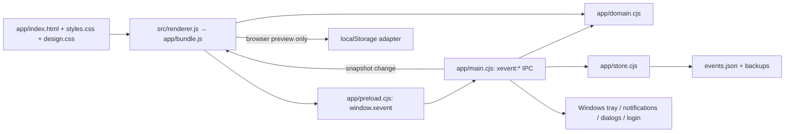

# Architecture / 架构

The existing desktop and UI implementation is preserved. This map covers the maintained source files, not installed dependencies or historical build copies.

本次保留现有桌面和界面实现。以下文件地图描述项目源码，不逐项列举安装依赖或历史构建副本。

## Runtime boundaries / 运行边界

`package.json` points Electron at `app/main.cjs`. The main process requests a single-instance lock, opens a frameless window, loads `app/index.html`, and owns the tray and the reminder timer. The window disables Node integration and enables context isolation and sandboxing. Requests must come from the current window's file page. New windows/navigation are blocked; external HTTP/HTTPS links are opened through the explicit API.

`package.json` 将 Electron 入口设为 `app/main.cjs`。主进程申请单实例锁，创建无边框窗口，加载 `app/index.html`，管理托盘和提醒定时器。窗口关闭 Node 集成，启用上下文隔离和沙箱。请求须来自当前窗口的本地页面。窗口导航和新窗口受限；外部 HTTP/HTTPS 链接通过专门 API 打开。

`preload.cjs` exposes named operations rather than arbitrary Node access. Main-process handlers return `{ok,value}` or `{ok,error}`; the bridge converts errors into rejected promises. After mutations, the main process sends `xevent:change` with a Store snapshot. Notification clicks send `xevent:select` to select a matter. The renderer redraws from that snapshot while preserving focused inputs and scroll position where implemented.

`preload.cjs` 只暴露具名操作，不开放任意 Node 能力。主进程返回 `{ok,value}` 或 `{ok,error}`，桥接层将失败转换为 Promise 拒绝。修改后主进程以 `xevent:change` 广播 Store 快照，通知点击通过 `xevent:select` 选择事项；界面据此重绘，并在现有实现中保留输入焦点和滚动位置。

In browser preview, `renderer.js` detects the absence of `window.xevent` and uses its own localStorage adapter. This shares validation/view code but not desktop persistence, notifications, tray, file dialogs or login integration. Markdown is parsed by Marked and sanitized by DOMPurify; remote images and active embeds are excluded by the renderer policy.

浏览器预览在没有 `window.xevent` 时使用 `renderer.js` 内的 localStorage 适配器。它复用校验与视图代码，但不使用桌面文件存储、系统通知、托盘、文件对话框或开机启动。Markdown 经 Marked 解析、DOMPurify 清理；界面策略排除远程图片和活动嵌入内容。

## File map / 文件地图

| File | Content / 内容 |
| --- | --- |
| `package.json` | Version, scripts, dependency ranges, Electron entry and portable x64 packaging / 版本、命令、依赖、入口和打包配置 |
| `package-lock.json` | Exact dependency resolution and integrity metadata / 精确依赖与完整性信息 |
| `src/renderer.js` | Views, editors, Markdown, keyboard/drag handling, search and browser adapter / 视图、编辑、Markdown、快捷键、拖动、搜索及浏览器适配 |
| `app/main.cjs` | Desktop lifecycle, IPC handlers, import/export, reminder timer and Windows integration / 桌面生命周期、IPC、导入导出、提醒与系统集成 |
| `app/preload.cjs` | API bridge and snapshot/selection listeners / API 桥接与快照／选择监听 |
| `app/domain.cjs` | Enumerations, normalization, deadline calculations, attention ranking, reminder candidates and samples / 枚举、校验、截止计算、关注排序、提醒候选与示例 |
| `app/store.cjs` | Read/normalize JSON, temporary-write-and-rename saves, backups and snapshots / JSON 读取校验、临时写入与重命名、备份与快照 |
| `app/index.html` | CSP, stylesheet order, application/dialog containers and bundle entry / 内容安全策略、样式顺序、容器与 bundle 入口 |
| `app/styles.css` | Base component/layout/responsive rules / 基础组件、布局和响应式规则 |
| `app/design.css` | Current visual overrides, loaded after the base stylesheet / 在基础样式后加载的当前视觉覆盖层 |
| `app/THIRD_PARTY_NOTICES.txt` | Dependency attribution, packaged by the existing `app/**/*` rule / 依赖许可，通过现有规则随 app 打包 |
| `assets/icon.svg` | Original app icon / 原始应用图标 |
| `assets/icon.png`, `assets/icon.ico` | Generated 256px PNG and seven-size Windows ICO / 生成的 PNG 与七种尺寸 ICO |
| `scripts/build.cjs` | Bundle renderer with esbuild and copy SVG into app assets / 打包界面并复制 SVG |
| `scripts/icons.cjs` | Render SVG using sharp and assemble ICO / 栅格化 SVG 并生成 ICO |
| `scripts/preview.cjs` | Local HTTP preview on 127.0.0.1:4173; does not build first / 本地预览服务，不自动构建 |
| `scripts/smoke-desktop.cjs` | Actual Electron/preload/IPC/file smoke using a fresh temporary profile / 隔离目录中的真实桌面冒烟 |
| `scripts/check-repository.cjs` | Required files, local documentation links, bundle and lockfile checks / 文件、文档链接、构建产物与锁文件检查 |
| `tests/domain.test.cjs` | 11 domain/storage checks / 11 项领域与存储检查 |
| `tests/main.test.cjs` | 4 main-process handler checks with OS boundaries mocked / 4 项模拟系统边界的主进程检查 |
| `.github/workflows/verify.yml` | Windows CI install, tests, build, desktop smoke and portable packaging / Windows 自动安装、测试、构建、桌面冒烟与打包 |
| `README.md`, `README.zh-CN.md` | Equivalent English/Chinese setup and usage / 等价的中英文说明 |
| `RIGHTS.md` | Bilingual reservation of project-owned rights; no open-source grant / 双语项目权利保留声明，不授予开源许可 |
| `使用说明.md` | Short end-user instructions / 简明用户操作说明 |
| `docs/validation.md` | Verification evidence and remaining manual checks / 验证证据与剩余手工检查 |
| `docs/images/overview.png` | Real desktop screenshot with synthetic examples / 真实桌面与虚构示例截图 |
| `.gitignore` | Exclude private data, dependencies and regenerable/historical outputs / 排除私人数据、依赖和可生成／历史产物 |

Generated `app/bundle.js` and `app/assets/icon.svg` are not source-of-truth files. Do not hand-edit the bundle. The two stylesheets are complementary; deleting the base stylesheet is not a safe cleanup.

生成的 `app/bundle.js` 和 `app/assets/icon.svg` 不是权威源码，请勿手改 bundle。两个样式表互相补充，不能把基础样式当作废弃文件删除。

## Data and reminders / 数据与提醒

Store format 1 contains `settings`, `events`, and `notificationHistory`. Matters hold stable IDs, category/status/priority, deadline and follow-up, goal/strategy/next action, stages, notes, links, timestamps, trash and snooze fields. Import normalization rejects invalid dates/duplicate IDs. Import merges by ID, accepts newer `updatedAt` values, and retains local preferences.

格式版本 1 包含 `settings`、`events`、`notificationHistory`。事项包含编号、分类／状态／优先级、截止与跟进、目标／策略／下一步、阶段、笔记、链接、时间戳、回收站与稍后提醒字段。导入校验拒绝无效日期和重复编号，再按编号和较新的 `updatedAt` 合并，保留本机偏好。

After startup, reminders are first checked after five seconds and then every 30 seconds. Domain logic excludes completed/trashed matters and active snoozes from notification candidates. Attention-view logic does not exclude snoozes, so a snoozed matter may still appear there. Deduplication keys are persisted, retaining up to 2,000 history entries. More than two affected matters are grouped into a summary. Reminders are local-time based; portable binary output is not a strict reproducibility target.

启动五秒后首次检查提醒，此后每 30 秒检查。领域逻辑排除已完成、回收站以及暂缓中的通知候选；“需要关注”视图不排除暂缓，所以它仍可能显示该事项。去重键持久化，最多保留 2,000 条历史；涉及两条以上事项时汇总通知。提醒按本地时间计算，不把可移植二进制逐字节一致作为复现目标。

## Local-only material / 仅本地保留的内容

Old EXEs and unpacked builds, test profiles and caches, the downloaded Electron archive, and the original detailed local analysis report remain local and are excluded. The original report contains workstation paths, so the portable file map above replaces it in the public repository. No normal user database is needed for installation or validation.

旧 EXE 与解包产物、测试数据和缓存、Electron 下载包及原始详细拆解报告在本地保留并排除提交。原报告包含本机路径，公开仓库以此处可移植文件地图代替。安装与验证不需要真实用户数据库。
